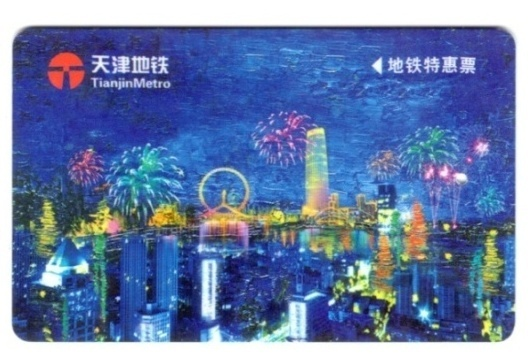
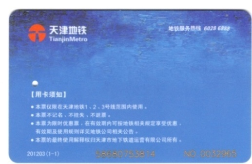

# tianjin-metro
天津地铁特惠票数据格式分析

### 卡片外观 

### 数据格式

### 一些说明
##### 各块数据都已经加了颜色区分，暂时懒得标各颜色代表的内容了。无非就是数据的十六进制。过几天看心情加吧，白色块为未解析出来的内容，如果有朋友分析出来或者发现问题，欢迎 Pull requerts
##### 虽然每张卡的密码都不一样，但是为了防止被复制，所以清空密码区域的数据。密码貌似是根据卡片UID生成的，大家可以自己研究一下密码的生成算法
##### 以上内容仅供学习参考，不得用于任何商业和违法活动。如果因此造成损失，全部由使用者本人承担！

### 用户协议
MIT License
